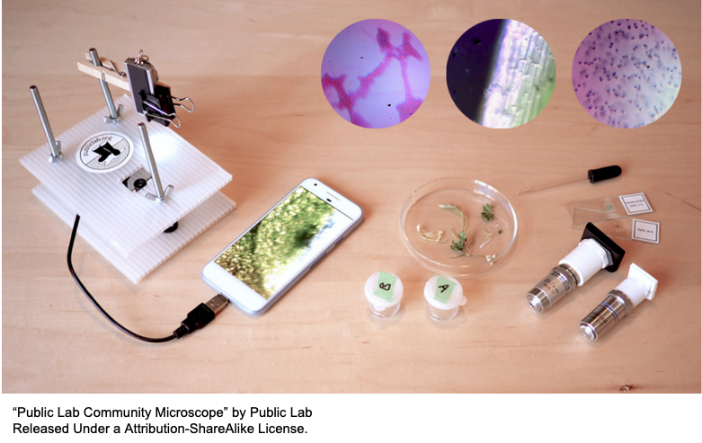
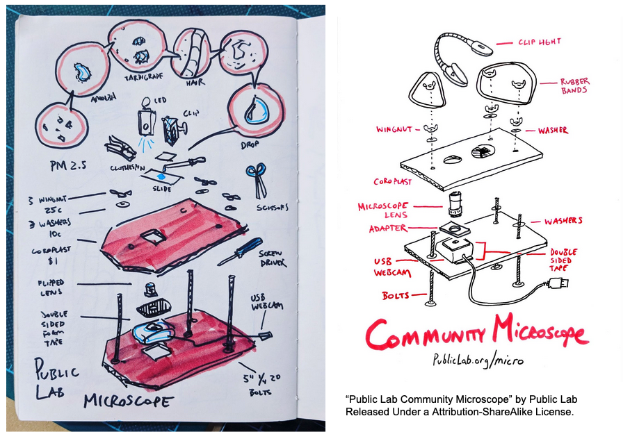
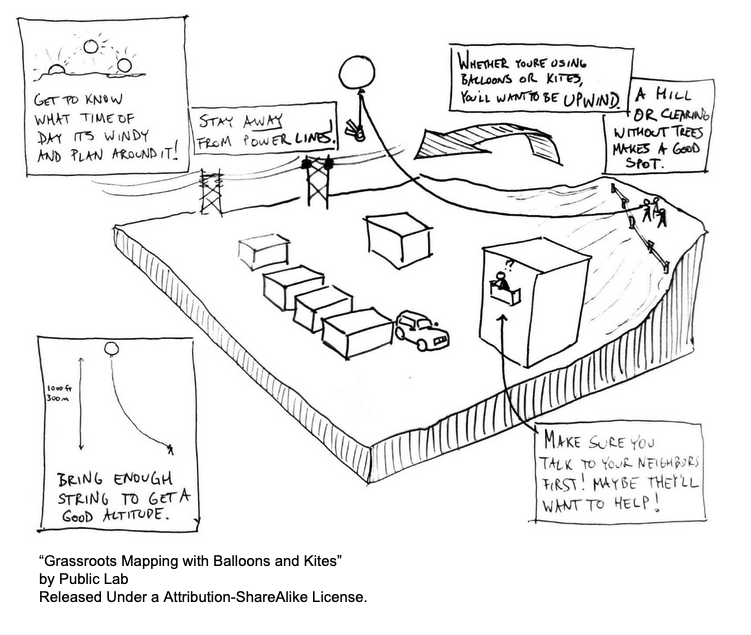
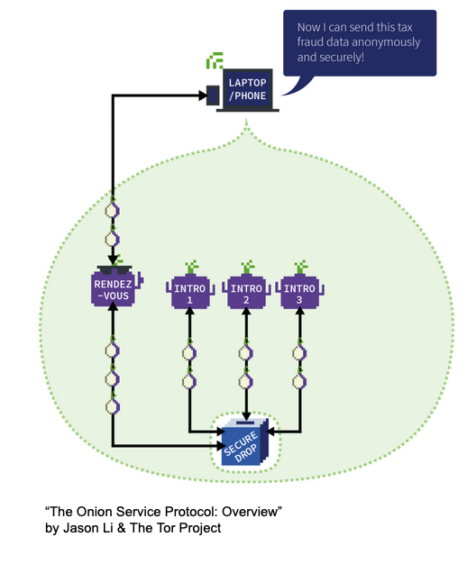

# Visual Strategies for Visual Comms. Checklist

**Introduction/ Purpose of this Document**

The purpose of this checklist is to provide insight in developing visual communication strategies with illustrators in creating visual aids for problem solving and tool making.

Let’s brainstorm strategies to strengthen the documentation of a project, or how to communicate to illustrators what we need to help create supplemental documentation!

This project is loosely based from the DSPPUX Checklist which was workshopped at RightsCon in 2018, available at

[https://github.com/SCheee/DSPPUX-Checklist](https://github.com/SCheee/DSPPUX-Checklist)

---

## Part 1: Research

Examples of potential projects that could be used with this checklist: hardware documentation, recipe, system of support (software library), policy systems, environmental systems. Start with a clear list of objectives in creating visuals for your project, as well as integrating some suggestions in this checklist. A clear list of objectives includes your goals in producing visual communications, meeting your audience needs, or a design brief given to you. 

### Who is your audience?

Sometimes when working with organizations or tool makers, we do not have access to user research so make sure you ask the org the right questions when working with them!

- [ ]  Does the platform/ tool maker you’re working with know who their main uses are? Does it match with their intended audiences?
- [ ]  Will these visual aids/ illustrations supplement multiple languages?
- [ ]  Will this be in print or will it be digital?
- [ ]  If digital, what is the bandwidth access like for the audience?
- [ ]  Does the project consider cultural taboos of the user group?

### Considerations to Ask Client/ Client to Communicate

Keeping your audience in mind is important, but you also want to make sure you're also covering the project needs of your client. Clients can also look at this checklist to help create a brief that can cover these considerations as well. 

- [ ]  Are the tools/ systems involved open source? Is there any proprietary, sensitive, private, or culturally specific (i.e. appropriation-risking) information that cannot be shared?
- [ ]  Have there been any considerations for audiences with accessibility needs?
- [ ]  Do their current streams of communication use a lot of jargon?
- [ ]  Do the tools (whether physical or systematic) proposed in the org’s strategy have clear documentation on how the tool/ problem/ solution operates?
- [ ]  Does the current branding allow flexibility for accessibility needs (example, for either high contrast visibility, or low bandwidth connections)?

### Check-In

- [ ]  Do you fully understand the issue or tool that you are currently trying to communicate? (Further onboarding or research will need to be done otherwise).
- [ ]  At what stage is this project (is it early stage, in progress, or early stage)?
- [ ]  You have a network of experts (related to your project) that you can ask for feedback from.

---

## Part 2: Sketching Strategies

### 1) For toolkits:

**Knolling:** Displaying all the tools involved to a user while also grouping by tool similarities and importantness while also hinting at the order of use. 

- [ ]  For social/ research tool kits that span across different cultures, try to use and do research on universal styles of icons, colours and symbols.
- [ ]  Is there a consideration in the grouping of items that are sorted by similiarities in objects, importantness, or the order of use?

### 2) For building physical tools:

**Exploded View Diagrams:** Similar idea as the knolling diagram, but provides insight into understanding repair, modification, and the interactions of all of the parts involved. 

- [ ]  Is this helpful in understanding repair, modification, or assembly of this tool?
- [ ]  Are instructions for use cases clear? Do they rely heavily on textual information

### 3) For breaking down logistics of a system (physical + digital):

**Systems Diagrams:** System's diagrams usually are less illustrative but usually come in the format of boxes and arrows to explain the workflow of a system. Below are two examples: one environmental system, and a digital system. There are limitations to adding metaphor in illustrating systems, for example sometimes adding more abstraction can add confusion to the process you're trying to communicate. 

- [ ]  Can your visuals be represented in more than just boxes and arrows?
- [ ]  Can it be a comic?
- [ ]  Can it be illustrative of its environment or context?
- [ ]  Is metaphor needed to communicate technical information?
- [ ]  Is the information too abstracted?
- [ ]  Are the metaphors you’re using a good fit for the cultural context of your audience?
- [ ]  Do metaphors help obfuscate important information that could be used against the system/ project?

---

## Part 3: Feedback + Evaluation

### Diversity + Accessiblity:

- [ ]  Language used does not rely on jargon.
- [ ]  Being mindful of culture in the development of visuals and copy.
- [ ]  Does the object/ drawing explain its own politics?
- [ ]  Do you use participatory research methods in part of developing work?
- [ ]  Does it meet accessibility criteria that was provided in your brief/ informed by your user group?

### Check In**:**

- [ ]  Were your objectives met?
- [ ]  Being mindful of culture in the development of visuals and copy.
- [ ]  Does the object/ drawing explain its own politics?
- [ ]  Do you use participatory research methods in part of developing the work?
- [ ]  If for a physical object, is it possible to print on the object or encode it into the design as a self explaining object?